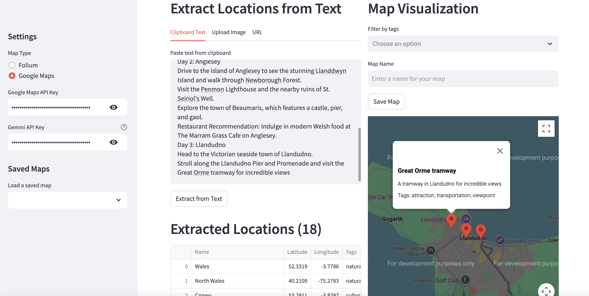

# Story2Map

Story2Map is a Streamlit application that extracts location names from text and visualizes them on interactive maps. The application leverages Gemini AI to identify place names and their relevant context, then displays them on either a Folium map (default) or a Google Map.



## Features

- **Multiple Input Methods**: Extract text from clipboard, uploaded images (via OCR), or web URLs
- **AI-Powered Location Extraction**: Uses Google's Gemini LLM to identify locations and their context
- **Two Map Types**: Choose between Folium maps (default) or Google Maps (with API key)
- **Location Tagging**: Automatically tags locations by type (restaurant, landmark, etc.)
- **Tag Filtering**: Filter map markers by tags to focus on specific location types
- **Save & Load Maps**: Save your maps and load them later to continue your work
- **Google Maps Integration**: Create shareable Google Maps links to open on mobile devices

## Installation

### Requirements

- Python 3.9+
- Tesseract OCR (for image text extraction)
- Google Gemini API key
- Google Maps API key (optional, for Google Maps visualization)

### Using pip

```bash
git clone https://github.com/yourusername/story2map.git
cd story2map
pip install -r requirements.txt
```

### Using conda

```bash
git clone https://github.com/yourusername/story2map.git
cd story2map
conda env create -f environment.yml
conda activate story2map
```

## API Keys Setup

Story2Map requires a Google Gemini API key for location extraction. For Google Maps visualization, a Google Maps API key is also required.

You can provide these keys in two ways:
1. Enter them directly in the app's sidebar
2. Create a `.env` file in the project root with the following content:

```
GEMINI_API_KEY=your_gemini_api_key_here
GOOGLE_MAPS_API_KEY=your_google_maps_api_key_here
```

## Usage

1. Start the application:

```bash
streamlit run app.py
```

2. The app will open in your browser at http://localhost:8501

3. Enter your API key(s) in the sidebar if not provided via .env file

4. Choose one of the input methods:
   - Paste text from clipboard
   - Upload an image containing text
   - Enter a URL to extract text from a webpage

5. The app will extract locations and display them on a map with appropriate tags

6. You can filter locations by tags, save the map, and create shareable links

## Data Storage

Maps and location data are stored in the `data` directory in the following formats:
- Location data: JSON files (`mapname.json`)
- Folium maps: HTML files (`mapname.html`)
- Google Maps: HTML files (`mapname_google.html`)
- Shareable URLs: Text files (`mapname_url.txt`)

## Example

1. Paste a travel blog post or article into the text input
2. Click "Extract from Text"
3. The app will identify all locations mentioned along with their context
4. Enter a name for your map and click "Save Map"
5. Use the tag filters to focus on specific location types (restaurants, landmarks, etc.)
6. If using Google Maps, get a shareable link to open on your mobile device

## License

This project is licensed under the MIT License - see the LICENSE file for details.

